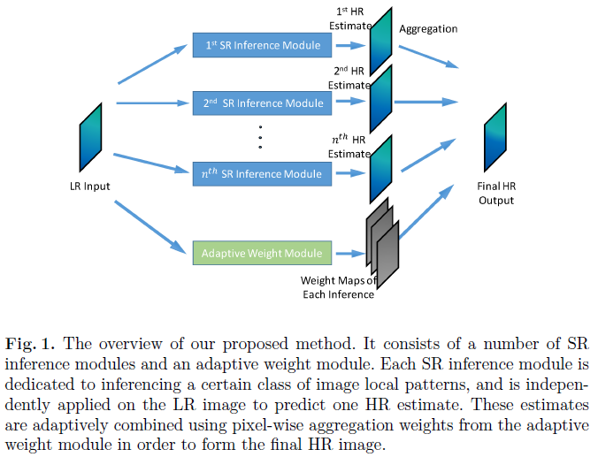
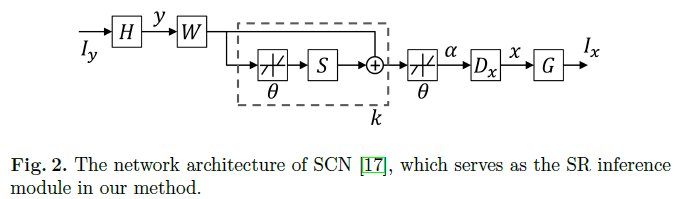
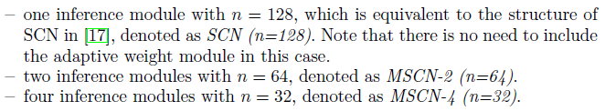
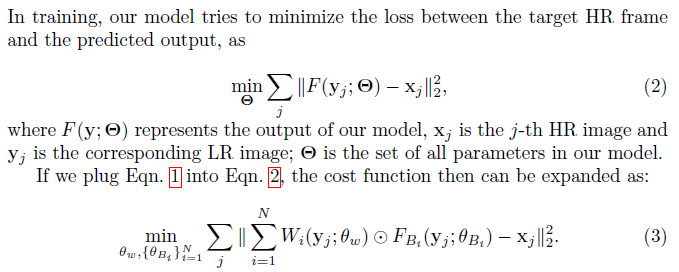

## Short introduction
Multiple SCNs merged by weight maps
## Main contributions
- combine predictions from multiple subspace of LR
## Architecture
### Overall

### SCN module

### Inference module

### Loss
- MSE
- Loss function:

### Training strategy

## Experiments
- Dataset: 91
- Evaluation metric: PSNR
- Patchsie: input 56 × 56 output 44 X 44
- Dict: sparse coding, LR: 9X9 HR: 5 X 5
- SGD, learning rate 0.00001, momentum 0.9

## Final summary
### Pros:
- 

### Cons:
- 
### Tips:
- Merging results from different predictions

