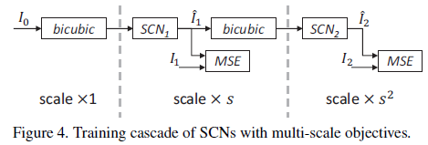
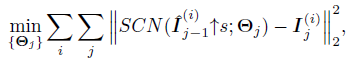

## Short introduction
ranks 2nd in terms of SSIM and 4th in terms of PSNR in the NTIRE2018 SISR challenge, runs 5 times faster than other submissions
## Main contributions
- combine sparse coding and deep learning
- using network cascading
- conduct a subjective evaluation
## Architecture
### Overall

### Cascade with mnulti-scale objectives

### Loss
- MSE
- Loss function:

### Training strategy
- Starts by training only the 2× portion of the network
- Incrementally add training pairs of the next scale
- Randomly select one of the scales s to avoid mixing batch statistics

## Experiments
- Dataset: 91
- Evaluation metric: PSNR
- Patchsie: input 56 × 56 output 44 X 44
- Dict: sparse coding, LR: 9X9 HR: 5 X 5
- SGD

## Final summary
### Pros:
- Combine sparse coding with deep learning as guidiance

### Cons:
- 
### Tips:
- Multi-scale objectives

