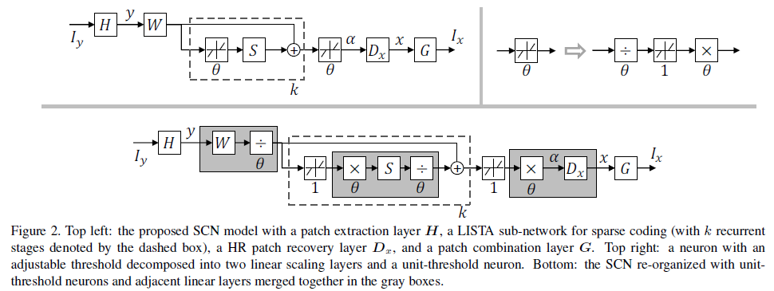
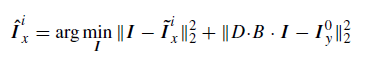
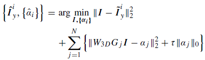

## Short introduction
Robust based on previous CSCN
## Main contributions
- Blur image upsampling
- Noisy image upscaling
- subjective evaluation
## Architecture
### Overall

### Loss
- MSE
- Loss function:
	- Blur image upscaling

	

	- Noisy image by block matching

	

### Training strategy

## Experiments
- Dataset: 91
- Evaluation metric: PSNR
- Patchsie: input 56 × 56 output 44 X 44
- Dict: sparse coding, LR: 9X9 HR: 5 X 5
- SGD

## Final summary
### Pros:

### Cons:

### Tips:

