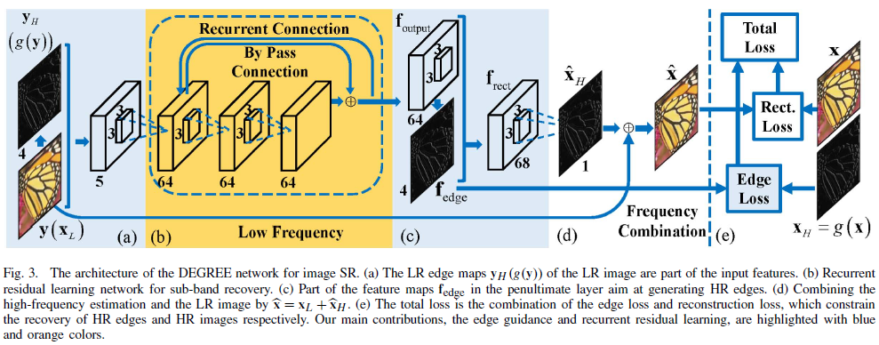
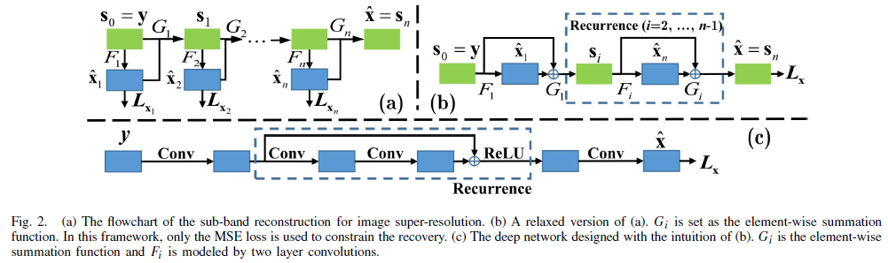

## Short introduction

## Main contributions
- integrate edge priors
- new framework to integrate prior knowledge
- recurrent residual structrue 
## Architecture
### Dense compression unints

### Recurrence

### Loss
- HR image and HR edges.
- Discriminator loss: MSE

### Training strategy
- Merging preditions from different sub-band
- Predict sub-band from acculmulating bands
- Randomly select one of the scales s to avoid mixing batch statistics

## Experiments
- Dataset: 91, only on u channel, other channel using bicubic upsampling
- Evaluation metric: PSNR and perceptual
- Patchsie: 33 × 33 with rotation and flip as agumentation
- SGD, learning rate from 0.0001, 270 epochs, 0.9 momentum

## Final summary
### Pros:
- Making use of edge info to improve high frequency detials
- recurrence and residual structure for better performance
### Cons:
- No detial about the hand-crafted edge gt obtaining
### Tips:
- SR is about the enhacement of info from different frequencies

