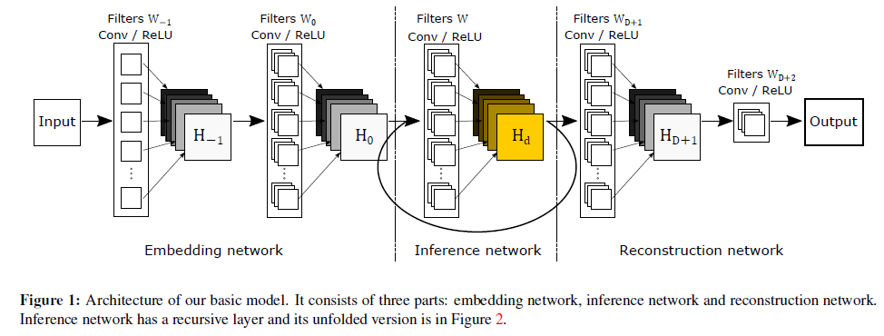
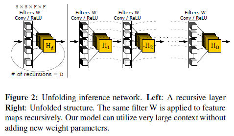
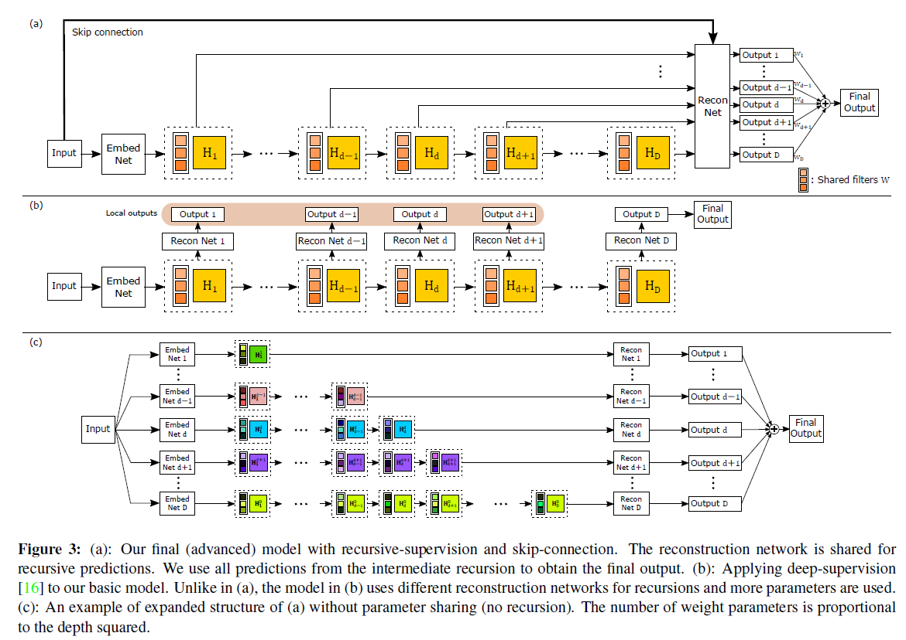
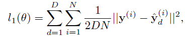
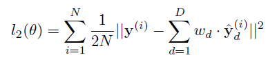
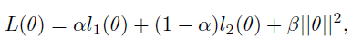

## Short introduction
Using recursive-supervision and skip-connection, combining all predictions resulting from different levels of recursions to deliver a more accurate final prediction.
## Main contributions
- recursive-supervision
- skip-connection

## Architecture

### Basic model

### Recursive unit

### Advanced model

### Loss
- Loss function: MSE

	- Intermediate loss

	

	- Final output loss
	
	

	- Final loss
	
	

### Training strategy
- Starts by training only the 2× portion of the network
- Incrementally add training pairs of the next scale
- Randomly select one of the scales s to avoid mixing batch statistics

## Experiments
- Dataset: 91 image, set5, set14, B100

## Final summary
### Pros:
- Better training and architecture for better results
### Cons:
- 
### Tips:

