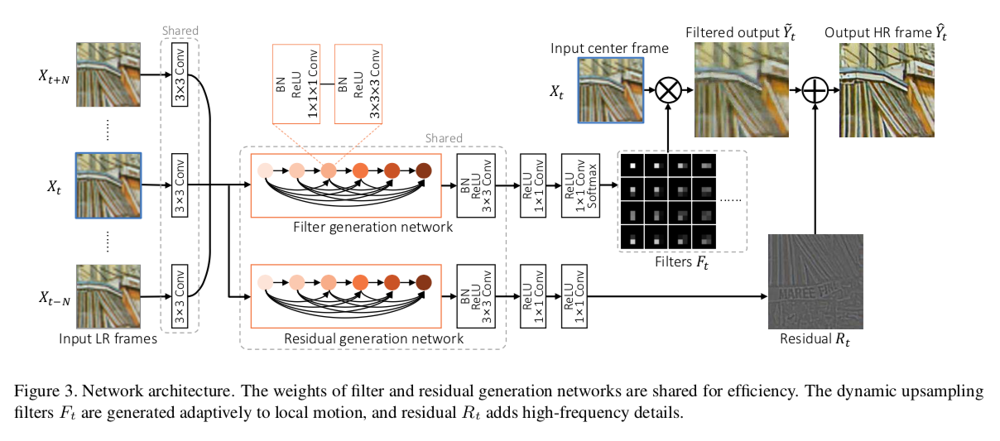
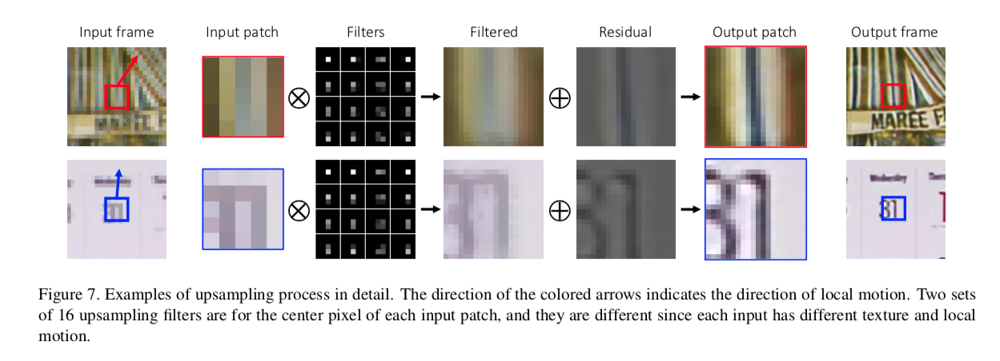

## Short introduction
This paper introduces a fundamentally different frame- work for VSR in this paper. They propose a novel end-to-end deep neural network that generates dynamic upsampling fil- ters and a residual image, which are computed depending on the local spatio-temporal neighborhood of each pixel to avoid explicit motion compensation. With this approach, an HR image is reconstructed directly from the input image us- ing the dynamic upsampling filters, and the fine details are added through the computed residual. This network with the help of a new data augmentation technique can generate much sharper HR videos with temporal consistency, com- pared with the previous methods. They also provide analysis of our network through extensive experiments to show how the network deals with motions implicitly.

## Pipelines

## Architecture
### The forward-inference network
- Framework

- data augmentation

### Loss metric
- PSNR, SSIM

## Experiments
- Dataset for training: 351 videos from the Internet with various contents including wildlife, activity, and landscape
- Results:

## Final summary
### Pros:

### Cons:
- 
### Tips:

