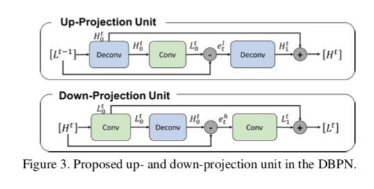
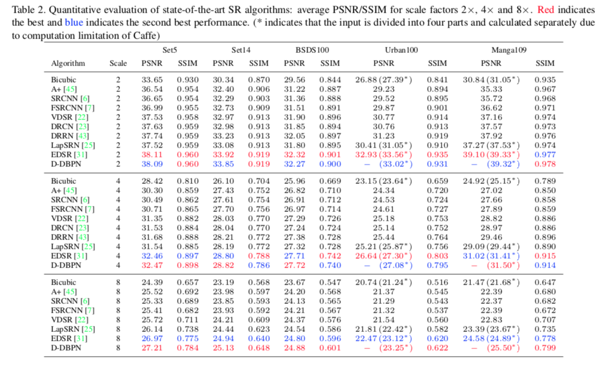

## Short introduction
This paper propose Deep Back-Projection Networks (DBPN), that exploit iterative up- and down- sampling layers, providing an error feedback mechanism for projection errors at each stage. We construct mutually- connected up- and down-sampling stages each of which represents different types of image degradation and high- resolution components. We show that extending this idea to allow concatenation of features across up- and down- sampling stages (Dense DBPN) allows us to reconstruct further improve super-resolution, yielding superior results and in particular establishing new state of the art results for large scaling factors such as 8× across multiple data sets.

## Pipelines

## Architecture
### The forward-inference network
- Framework

## Experiments
- Dataset for training: DIV2K
- Results:

## Final summary
### Pros:

### Cons:
- 
### Tips:

