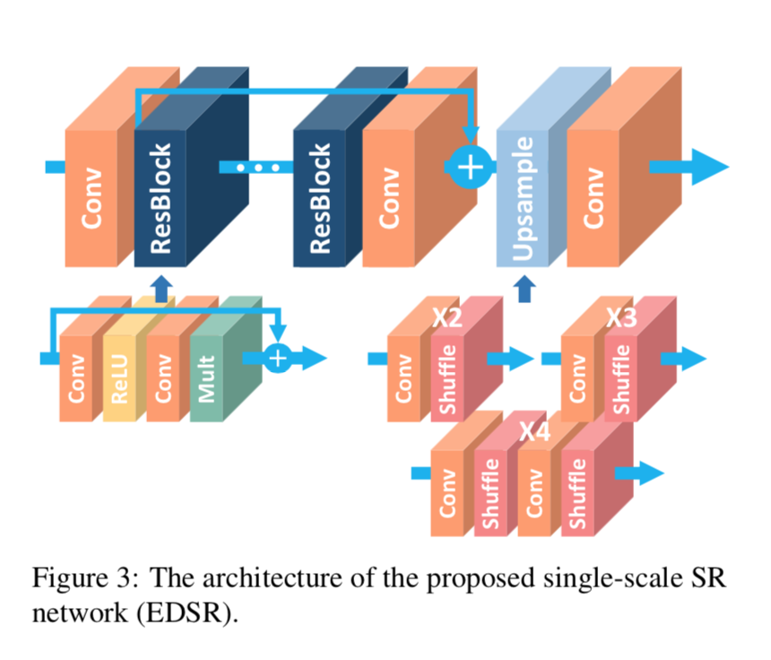

## Short introduction
1st place of NTIRE2017 challenge

## Main contributions

## Architecture
### The forward-inference network
- upsacling factor built-in model
- res-blocks + upscaling block

### Loss metric
- PSNR

## Experiments
- Dataset for training: DIV2K(800 ground truth images)
- Results:

## Final summary
### Pros:

### Cons:
- 
### Tips:

