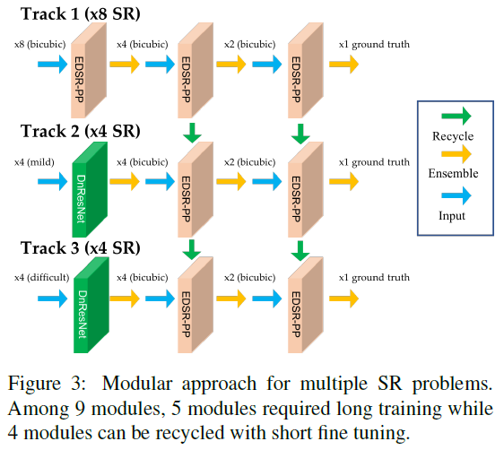
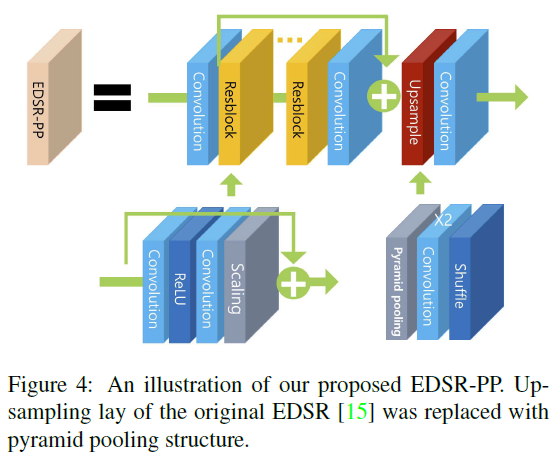
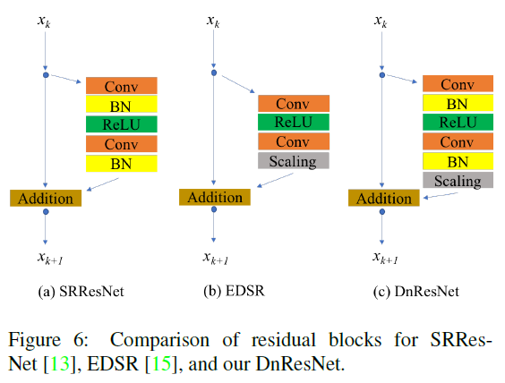

## Short introduction
Moduled based architecture with modified CNN.
## Main contributions
- Modular approach
- Improve EDSR with pyramid pooling
- DnResNet
## Architecture
### Module approach

### EDSR-PP

### DnResNet

### Loss

### Training strategy
- Fine tune existing modular for different track

## Experiments
- Dataset: DIV2k
- Evaluation metric: PSNR, SSIM
- Patchsie: 48 × 48
- Learning rate from 0.0001, 100 epochs, 0.00001 for next 200 epochs

## Final summary
### Pros:
- Great performance achieved in track 2 and 3 evaluated by PSNR
### Cons:
- Details are missing after denoising
### Tips:

