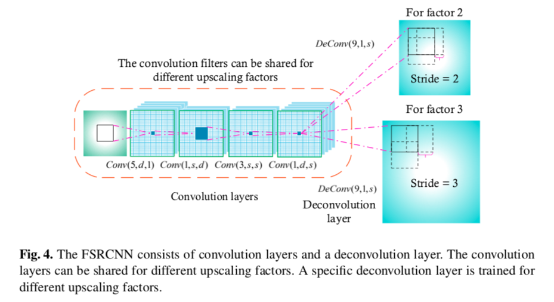
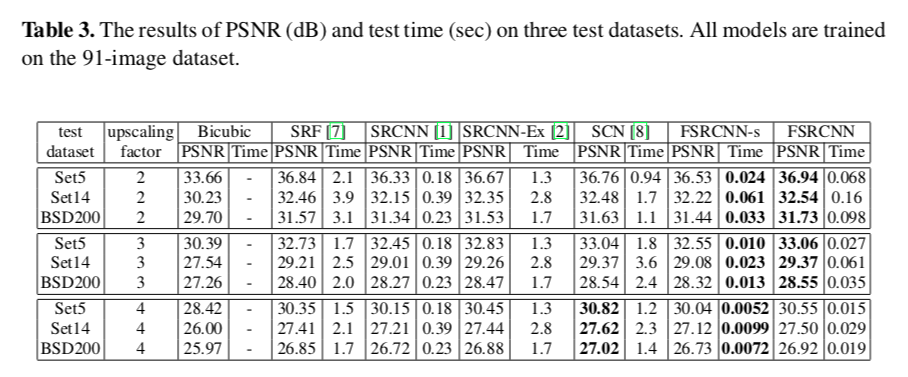

## Short introduction
This paper re-designs the SRCNN structure mainly in three aspects. First, we introduce a deconvolution layer at the end of the network, then the mapping is learned directly from the original low-resolution image (without interpolation) to the high-resolution one. Second, we reformulate the mapping layer by shrinking the input feature dimension before mapping and expanding back afterwards. Third, we adopt smaller filter sizes but more mapping layers. The proposed model achieves a speed up of more than 40 times with even superior restoration quality. Further, we present the parameter settings that can achieve real-time performance on a generic CPU while still maintaining good performance. A corresponding transfer strategy is also proposed for fast training and testing across different upscaling factors.

## Pipelines

## Architecture
### The forward-inference network
- Framework

### Loss metric
- PSNR, SSIM

## Experiments
- Dataset for training: Genearl-100 dataset
- Results:

## Final summary
### Pros:

### Cons:
- 
### Tips:

