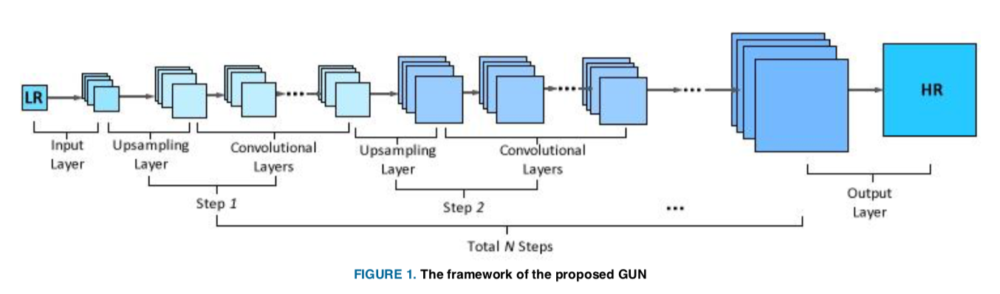
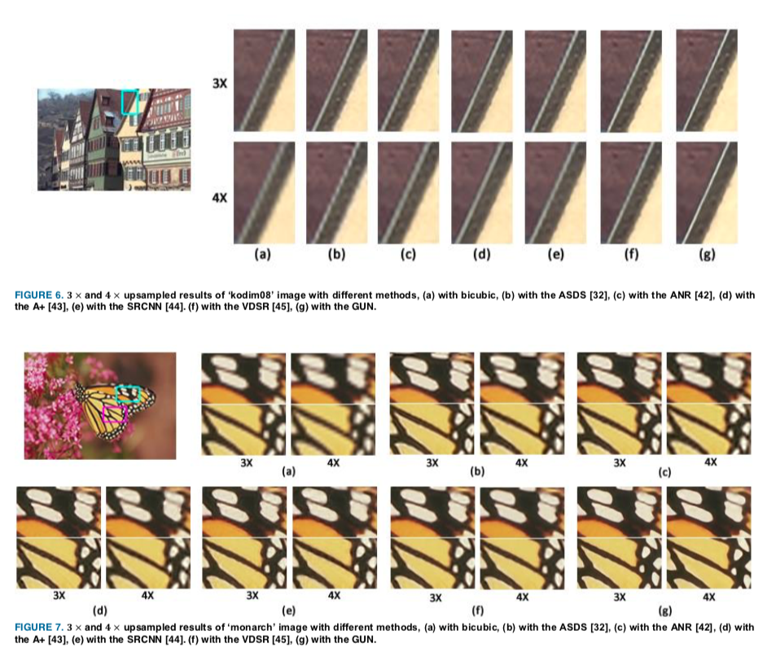

## Short introduction
The GUN consists of an input layer, multiple upsampling and convolutional layers, and an output layer. By means of the gradual process, the proposed network can simplify the direct SR problem to multistep easier upsampling tasks with very small magnification factor in each step. Furthermore, a gradual training strategy is presented for the GUN. In the proposed training process, an initial network can be easily trained with edge-like samples, and then the weights are gradually tuned with more complex samples. 

## Pipelines

## Architecture
- The proposed framework

### Loss metric
- PSNR

## Experiments
- Results:

## Final summary
### Pros:

### Cons:
- 
### Tips:

