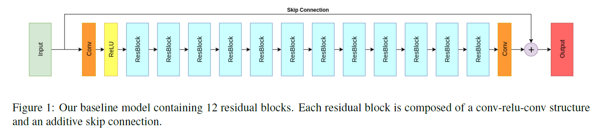
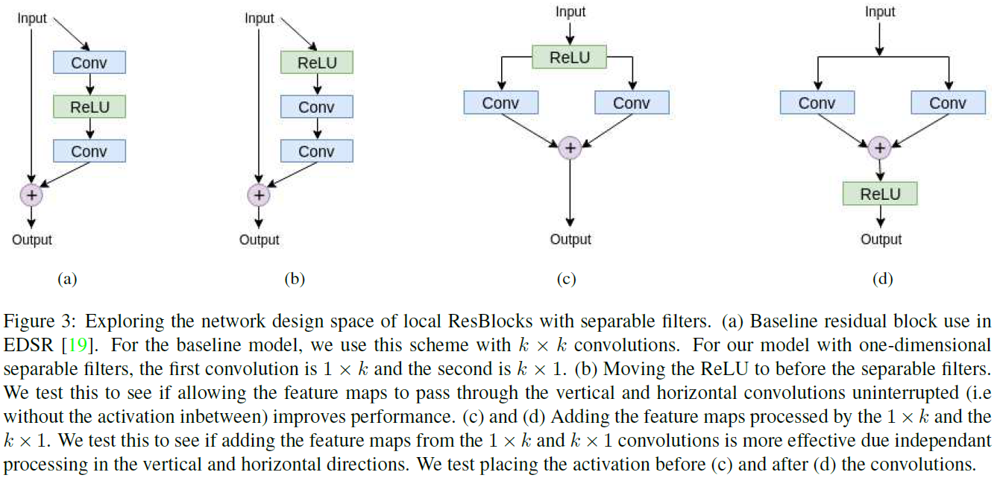

## Short introduction
Workshop paper of 2018CVPR
## Main contributions
- 1-D separable kernels
- atrous convolutions
## Architecture
### Baseline

### 1-D kernel

### Loss

### Training strategy
- Train on the first 100 images, select the best model, then finetune on the full dataset

## Experiments
- Dataset: DIV2k
- Evaluation metric: PSNR, SSIM
- Patchsie: 128 × 128,
- Adam, learning rate 0.0001, 300 epochs

## Final summary
### Pros:
- 
### Cons:
- 
### Tips:
- 

