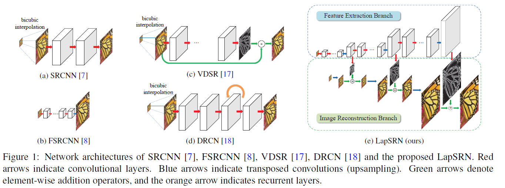
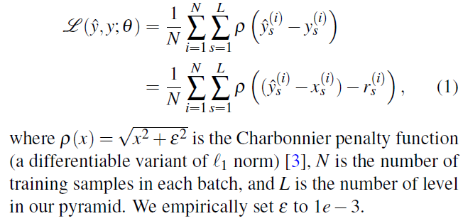
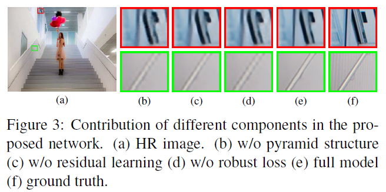

## Short introduction
Progressively reconstruct the sub-band residuals of high-resolution images.
## Main contributions
- progressive training
- multi-prediction in one forward-pass
## Architecture
### Architecture

### Loss

- Charbonnier penalty function
- Loss function:

### Training strategy

## Experiments
- Dataset: 91 images and BSD200

- Evaluation metric:  PSNR and SSIM

- Patchsie: 128 × 128 × 64, augmentation including rotation and flip

- Adam, learning rate 0.00001, 50 epochs, 0.9momentum

- Results:

  Training with L2 loss generates SR results with more ringing artifacts. 

  Intermediate predictions of our 8X model are slightly inferior to our 2X and 4X models.

  

## Final summary
### Pros:
- Good performance
### Cons:
- No fine details on buildings. All SR algorithms failed except selfExSR. Large model.
### Tips:
- Best results can be achieved by training with specific scale factors.

