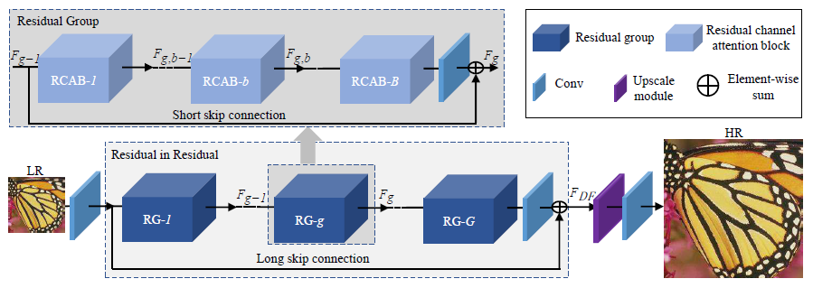
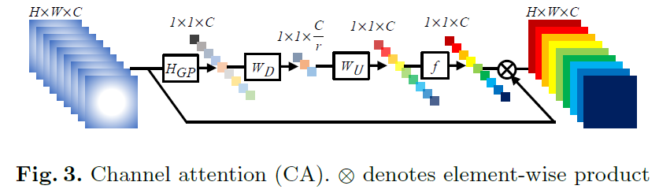
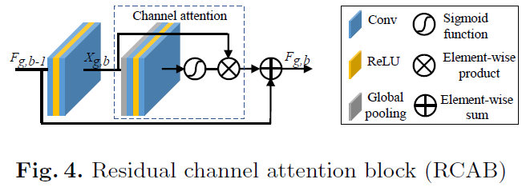
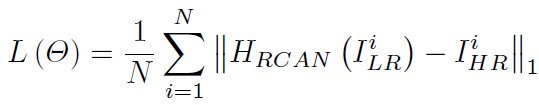

## Short introduction
RCAN improves the performance of very deep CNN for SR. RIR allows abundant low-frequenct unformation to be bypassed through multiple skip connections and focus on learning high-frequency information.
Attention model.

## Main contributions
- very deep residual channel attention networks (RCAN),
- propose residual in residual structure,
- propose channel attetion mechanism to adaptively rescale features by considering interdenpednencies among feature channels.

## Architecture

### RCAN

### Channel attetion

### Residual channel attetion block

### Loss
- L1
- Loss function:

## Experiments
- Dataset: DIV2k, Y channel
- Evaluation metric: PSNR, SSIM
- Patchsie: 48 × 48
- Adam, learning rate 0.0001, half evert 2X10^5 iterations

## Final summary
- special case of EDSR with 0.1 feature scalling

### Pros:
- Attention matters
- New bench mark on both quantitative and qualitative evalution

### Cons:
- Claim too much by using residual.

### Tips:
- Simplying stachking residual blocks is no applicable to achieve very deep and powerful networks for image SR

