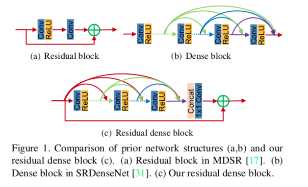
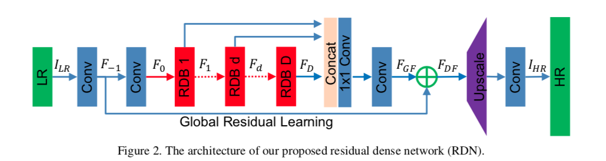
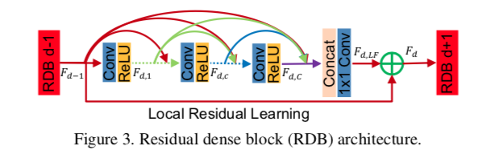

## Short introduction
This paper fully exploits the hierarchical features from all the convolutional layers. Specifically, they propose residual dense block (RDB) to ex- tract abundant local features via dense connected convolu- tional layers. RDB further allows direct connections from the state of preceding RDB to all the layers of current RDB, leading to a contiguous memory (CM) mechanism. Local feature fusion in RDB is then used to adaptively learn more effective features from preceding and current local features and stabilizes the training of wider network. After fully ob- taining dense local features, we use global feature fusion· to jointly and adaptively learn global hierarchical features in a holistic way.

## Pipelines

## Architecture
- The proposed residual dense block

- The global residual learning connection

- The local ressidual learning connection

### Loss metric
- PSNR, SSIM

## Experiments
- Dataset for training: DIV2k
- Dataset for test: DIV2K, LR image with unknown degradation
- Results:

- visual results on real-world images

## Final summary
### Pros:

### Cons:
- 
### Tips:

