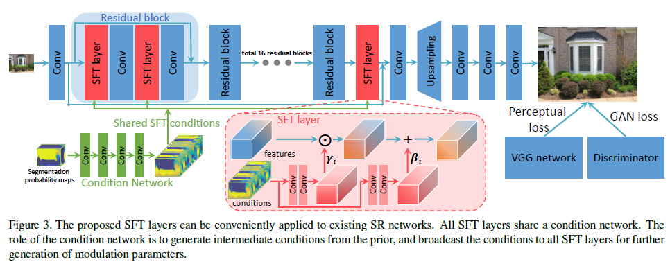
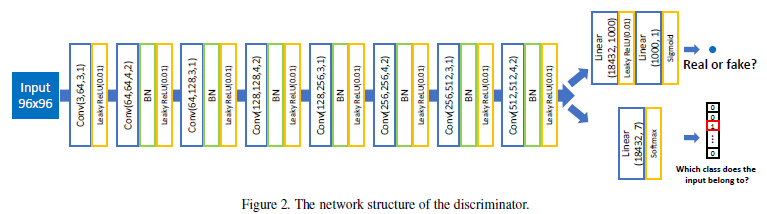

## Short introduction
Recove texture with semantic classes.
## Main contributions
- Using semantic segmentation results to recover texture according to different classes
## Architecture
### Overall arch

### Discriminator

Two branch for real/fake and class

### Loss
- Using perceptual loss (vgg19).
- Discriminator loss: least square loss on residual part 

### Training strategy

## Experiments
- Dataset: Imagenet
- Evaluation metric:PSNR, SSIM
- User study

## Final summary
### Pros:
- Textures are more great recovered with different style on different class
### Cons:
- Classes outside given category will be treat as background
### Tips:

