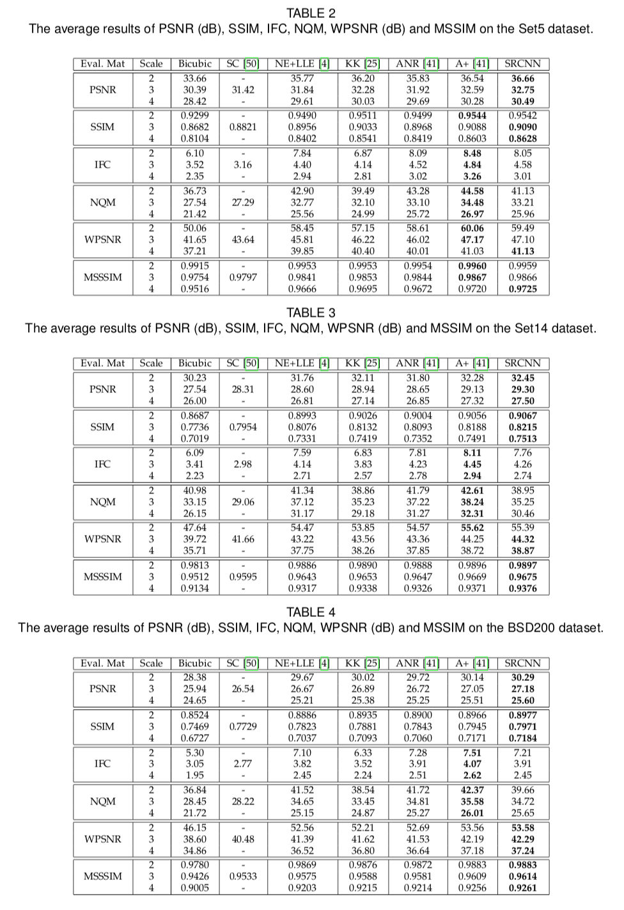

## Short introduction
For the first time, CNN was used in the image super-resolution task

## Main contributions

## Architecture
### The forward-inference network
- Three-layers convolutional neural network

### Loss metric
- PSNR, SSIM

## Experiments
- Dataset for training: ILSVRC-2013 395,909-images
- Dataset for test: Set5, Set14, BSD200
- Results:

## Final summary
### Pros:

### Cons:
- 
### Tips:

