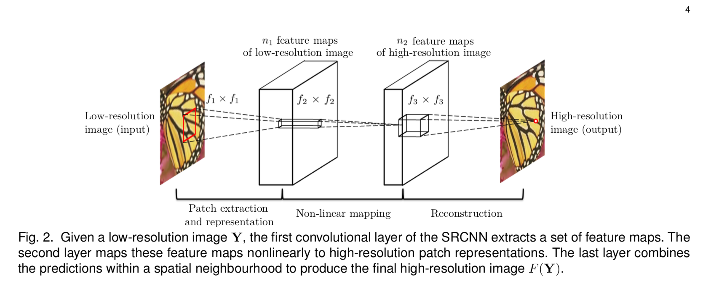

## Short introduction
ranks 2nd in terms of SSIM and 4th in terms of PSNR in the NTIRE2018 SISR challenge, runs 5 times faster than other submissions
## Main contributions
- progressive training
- Generate and discriminate loss at different scales

## Architecture
### The forward-inference network
- Three-layers convolutional neural network

### Loss metric
- PSNR, SSIM

## Experiments
- Dataset for training: 91-images and ILSVRC-2013 395,909-images
- Dataset for test: Set5, Set14, BSD200
- Results:

## Final summary
### Pros:
- Pyramid design and dense uint improve efficiency and accuracy
- New bench mark on both quantitative and qualitative evalution
### Cons:
- 
### Tips:
- Do not downsample the groundtruth to create labels,This avoids artifacts that may result from subsampling.

