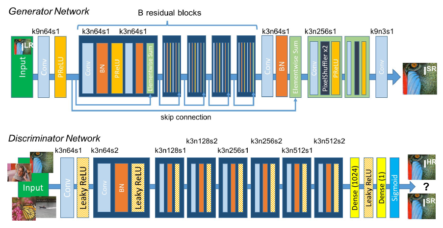
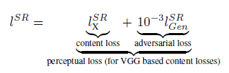
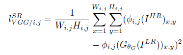
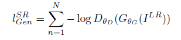

## Short introduction
Perceptual loss function with adversarial loss and a content loss
## Main contributions
- State-of-the-art results with 16 blocks-resnet
- perceptual loss, new content loss based on feature map of vgg
## Architecture
### Architecture

### Discriminator

### ProSR

### Loss
- Three loss functions at each scale (X2, X4, X8) providing a form of intermediate supervision.
- Using perceptual loss (vgg16: pool2, pool4).
- Discriminator loss: least square loss on residual part (gt: difference between image and bicubic upsampled image)
- Loss function:

	- Content loss:

	- Adversarial loss:

### Training strategy

## Experiments
- Dataset: 350 tousand images from the ImageNet database
- Evaluation metric: PSNR, SSIM, MOS
- Patchsie: 96 × 96
- Adam, learning rate 0.0001
- Both on traditional and perceptual loss

## Final summary
### Pros:
- Mean opninion score testing
- Content loss for generator
### Cons:
- 
### Tips:
- Using higher level VGG feature maps yields better texture details compared to low level ones.
