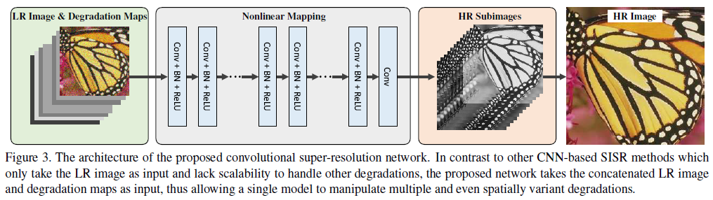
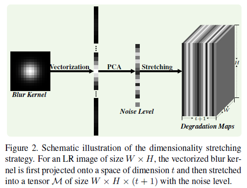
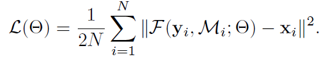

## Short introduction
Adding random blur kernel and noise during training for better performance
## Main contributions
- Introduce noise level and blur level
- For multiple and even spatially variant degradations
- Better results both on PSNR and perceptual
## Architecture
### Over archticture

### Input feature

### Loss
- Loss function:

### Training strategy
- In the training phase, we randomly select a blur kernel and a noise level to synthesize an LR image and crop N = 128×3, 000 LR/HR patch pairs (along with the degradation
maps) for each epoch.

## Experiments
- Dataset: DIV2k,WED4744, BSD400
- Evaluation metric: 
- Patchsie: 40 × 40 input,
- Adam, learning rate 0.0001, 100 epoch, 0.00001 another 100 epochs
## Real Image SR

## Final summary
### Pros:
- Combine the noise and SR task
- Robust and detail enhanced results robust with noise
### Cons:
- All the eperiments on generated LR images are depolyed with known blur kernel and noise level
- For real images, the degradation maps is used by a called 'grid search strategy', no details???
### Tips:

