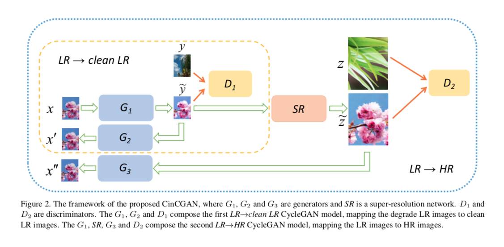
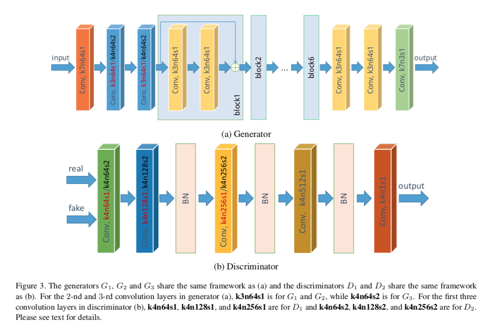
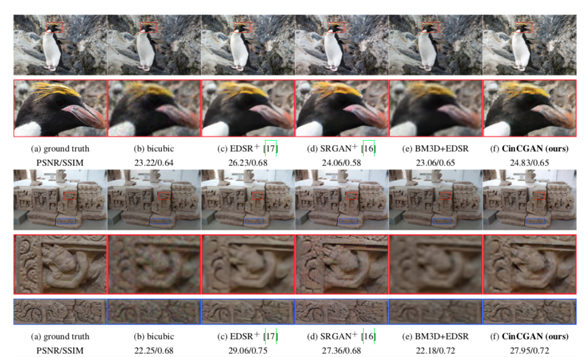

## Short introduction
In real application, the LR images are often degraded by noises and bluring. To solve this problem, this paper resorts to unsupervised learning without paired data, inspired by the recent successful image-to- image translation applications. With generative adversar- ial networks (GAN) as the basic component, the authors propose a Cycle-in-Cycle network structure to tackle the problem within three steps.

## Pipelines
First, the noisy and blurry input is mapped to a noise-free low-resolution space. Then the in- termediate image is up-sampled with a pre-trained deep model. Finally, we fine-tune the two modules in an end-to- end manner to get the high-resolution output. 

## Architecture
### The forward-inference network
- Framework

- Networks used

### Loss metric
- PSNR, SSIM

## Experiments
- Dataset for training: DIV2k
- Dataset for test: DIV2K, LR image with unknown degradation
- Results:

## Final summary
### Pros:

### Cons:
- 
### Tips:

