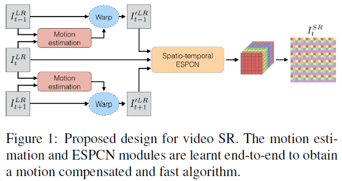
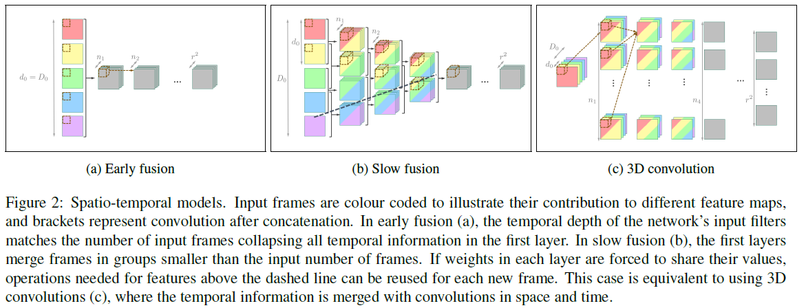
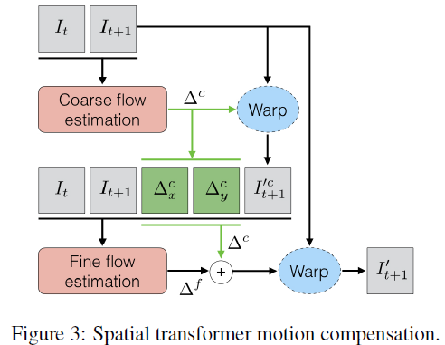
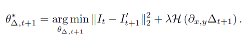

## Short introduction
fast and efficient video SR
## Main contributions
- real-time approach for video SR based on sub-pixel convolution and spatio-temporal networks that improves accuracy and temporal consistency
- comparing early fusion, slow fusion and 3D convolutions for discovering spatio-temporal correlations
- dense inter-frame motion compensation based on a multi-scale spatial transformer network
- efficient, end-to-end trainable motion compensated video SR algorithm
## Architecture
### Baseline

### Fusion

### Motion compensation

### Loss
- Loss function:
  - MSE

### Training strategy
- Double batch size until it reaches a maximum size of 128

## Experiments
- Dataset: CDVL
- Evaluation metric: PSNR, SSIM
- Patchsie: 33 × 33
- Learning rate 0.0001

## Final summary
### Pros:
### Cons:
### Tips:
- Huber loss has a smooth L2 behavior near the origin and is sparsity promoting far from it.

  

