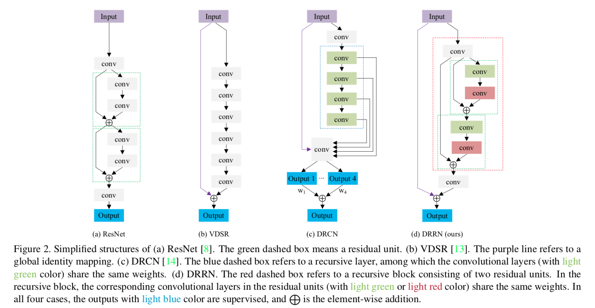
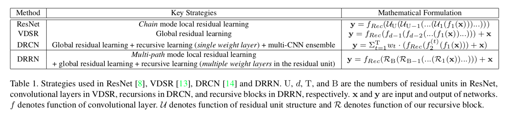
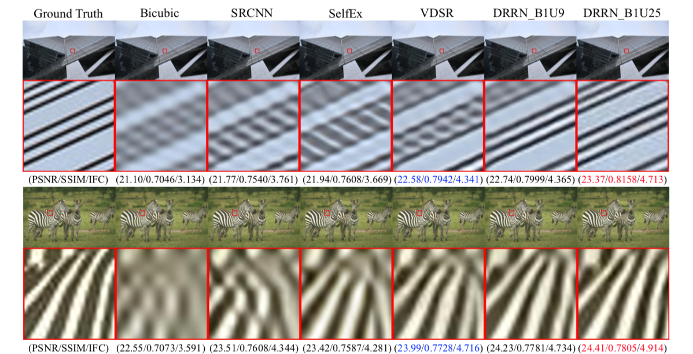

## Short introduction
This paper proposes a very deep CNN model (up to 52 con- volutional layers) named Deep Recursive Residual Network (DRRN) that strives for deep yet concise networks. Specifi- cally, residual learning is adopted, both in global and local manners, to mitigate the difficulty of training very deep net- works; recursive learning is used to control the model pa- rameters while increasing the depth.

## Architecture
### The forward-inference network
- Framework

- Networks used

### Loss metric
- PSNR, SSIM

## Experiments
- Dataset for training: 291 images
- Dataset for test: set5, set14, urban100
- Results:

## Final summary
### Pros:

### Cons:
- 
### Tips:

